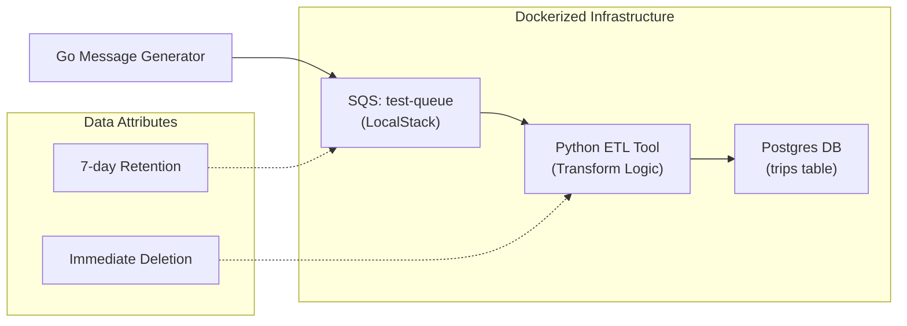

# Bayzat_Assessment
# SQS Data Pipeline: Production Documentation

This document provides a comprehensive overview of the SQS Data Pipeline project, detailing the architecture, implementation, and operational steps following the Software Development Life Cycle (SDLC) framework.

## 1. Project Overview & Objective
Objective: Build a robust, scalable ETL (Extract, Transform, Load) tool that consumes real-time message data from an AWS SQS queue (emulated via LocalStack), transforms it into a unified "Trip" format, and persists it into a production-grade relational database.

Outcome: A fully containerized data pipeline that can be launched with a single command, capable of handling varying message structures (e.g., location-based vs. route-based segments) with high reliability.

## 2. Architecture & Data Flow
The pipeline follows a decoupled, containerized architecture. The ETL tool acts as the intelligent bridge between the message source and the database sink.



## 3. Tech Stack
| Component | Technology | Role |
| Infrastructure | LocalStack | Emulator for AWS SQS |
| Database | PostgreSQL 15 | Relational storage for transformed records |
| ETL Logic | Python 3.11 | Core transformation and processing engine |
| Cloud SDK | Boto3 | AWS SDK for SQS integration |
| DB Adapter | Psycopg2-Binary | Database connectivity |
| Orchestration | Docker Compose | Unified environment management |
| Build System | Docker | Containerization of the ETL service |

## 3. SDLC: Implementation Phases

### Phase 1: Planning & Requirements Analysis
- Service Selection : Leveraged LocalStack to avoid AWS cloud costs while maintaining API parity.
- Data Schema Definition : Analyzed inputs from the `message_generator` (Go) to identify two distinct JSON schemas:
    1. `route`-based (segment durations and start times).
    2. `locations`-based (GPS coordinate timestamps).
- Target Structure : Standardized output to include: `id`, `mail/name`, `departure`, `destination`, `start_date`, and `end_date`.

### Phase 2: Design & System Architecture
- Infrastructure Architecture : A three-container stack:
    - `localstack`: The message source.
    - `postgres`: The data sink.
    - `etl-tool`: The processing bridge.
- Security Logic : Implemented mock AWS credentials (`access_key_id=test`) to bypass SDK validation without requiring real IAM keys.
- Communication : Used Docker internal DNS (e.g., `http://localstack:4566`) for secure service-to-service networking.

### Phase 3: Implementation
- ETL Tool Logic :
    - Built a robust transformation engine in Python using the `json` and `datetime` libraries.
    - Implemented a mandatory 7-day Message Retention Period (604,800 seconds) on the SQS queue. This ensures the queue is automatically emptied of unprocessed messages older than 7 days.
    - Implemented "Check & Skip" logic for malformed messages.
    - Added automated SQS message deletion (ACK) only after successful DB commit to ensure data integrity.
- Database Schema : Created a `trips` table with indexing on `id` for optimized lookups.
- Containerization : Wrote a multi-stage `Dockerfile` to keep dependencies minimal and reproducible.

### Phase 4: Integration & Testing
- Integration : Linked the ETL tool to wait for and depend on the `localstack` and `postgres` services.
- Data Generation : Executed cross-platform Go binaries in a controlled environment to populate the queue with realistic test data.
- Verification : Used `awslocal` CLI tools and `psql` queries to verify the full flow (SQS -> ETL -> DB).

### Phase 5: Operations & Deployment
- Final deployment is achieved through a single `docker-compose up -d --build` command.
- Detailed logs are accessible via `docker logs`, providing visibility into processing latency and message counts.

## 4. Output & Transformation Format
The ETL tool transforms raw, variable JSON inputs into a standardized "Trip" format:

Example Standardized JSON Output:
```json
{
    "id": 1,
    "mail": "example@email.com",
    "name": "Full Name",
    "trip": {
        "depaure": "Origin Point",
        "destination": "Destination Point",
        "start_date": "2022-10-10 12:15:00",
        "end_date": "2022-10-10 13:55:00"
    }
}
```

Database Schema (`trips` table):
| Field | Type | Description |
| id | SERIAL (PK) | Unique internal ID |
| user_id | INTEGER | Original ID from the message |
| mail | TEXT | User's email address |
| name | TEXT | Combined first and last name |
| departure | TEXT | Starting location name |
| destination | TEXT | Ending location name |
| start_date| TEXT | Formatted start timestamp |
| end_date | TEXT | Formatted end timestamp |

## 5. Key Challenges & Resolutions

### Challenge 1: Connection Security & Credentials
Issue: Newer versions of LocalStack require a specific acknowledgment of account requirements, and the AWS SDK throws `NoCredentialsError` if keys are completely missing.
Resolution: Implemented `LOCALSTACK_ACKNOWLEDGE_ACCOUNT_REQUIREMENT=1` and provided `test/test` mock credentials via environment variables to keep the SDK "happy" while remaining local.

### Challenge 2: Handling Diverse Message Formats
Issue: The `message_generator` produces payloads with different structures (`route` vs `locations`).
Resolution: Implemented a "Polymorphic Transformation" layer in the ETL tool that detects the schema type and applies the appropriate mapping logic dynamically.

### Challenge 3: Environment Reproducibility
Issue: Building Go binaries locally failed due to missing local toolchains.
Resolution: Containerized the build process using a `golang` Docker image, ensuring the binaries are identical across Windows, macOS, and Linux.

## 5. How to Run (Step-by-Step)

1. Prerequisites: Ensure Docker and Docker Compose are installed.
2. Setup: Run `docker-compose up -d --build` to launch the entire stack.
3. Generate Data: Execute the generator (e.g., `.\dist\message-generators\windows.exe`) from your host.
4. Monitor: Check ETL progress with `docker-compose logs -f etl-tool`.
5. Verify: Query the results from Postgres:
   ```bash
   docker exec task-postgres-1 psql -U user -d sqs_data -c "SELECT * FROM trips;"
   ```
